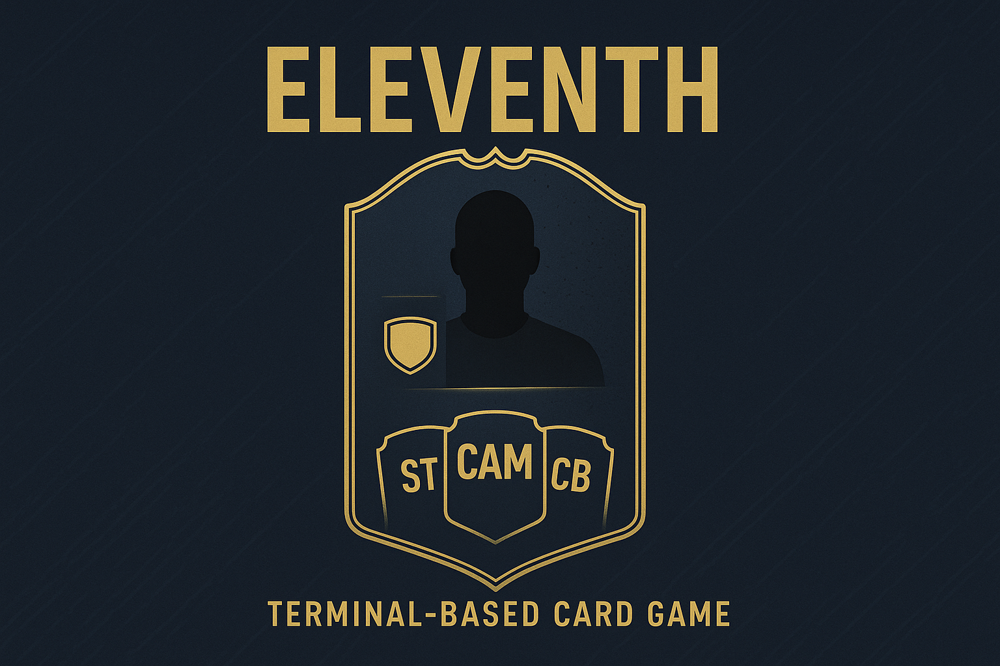

<h1 align="center">Eleventh</h1>

⚽ <em>Only 11 wins</em> 🃏

    

**Eleventh** is a turn-based card game inspired by FIFA’s Ultimate Team cards and the strategic style of Soccer Manager.
Players build their own dream team using collectible cards, manage tactics, and compete in tactical duels against other managers. 

## Notice

This is the 2nd version of this project and this is under maintenance.
Since the 2nd problem of the PBL differs a lot in architecture from the 1st one,
this is needed a new major version with possible breaking changes.

Now, this is possible to use HTTP frameworks, so QuickAPI will be deprecated.
Since the focus now is fault-tolerant system, I'll choose Typescript (Deno) or Elixir
to handle this correctly.

If you need to see the old project, open https://github.com/RickBarretto/Eleventh/tree/v1.0.0.

## PBL Context

This project was developed for the subject TEC502 – Concurrency & Connectivity, which is taught using a Problem-Based Learning (PBL) approach.

In PBL, students work in groups to solve open-ended problems, progressing step by step through research, discussion, and implementation. This project in specific is individual, but sessions are organized in group to share experiences and brainstorming.

Because of this nature, I've created the `.project/` folder that have the sessions summaries, goals and others.

## Architecture

This is a microservice based project, but I tried to reuse the server the maximum I could.
Since distributed systems are very complex, this is better to keep them simple with minimal
behavior.

Thinking that way, I decided to create two microservices that could work altogether in a future
implementation: `decks` and `match`. The first one, focused on managing decks (store user's owned,
rewarding and also trading).

Each service could easily be decoupled into smaller pieces, but due to the deadline I decided to don't.
The same goes with the connection of those pieces. Right now, both microservices are not connected,
and I don't plan due to the deadline. Since a PBl is a Proof-Of-Concept, this is not a big concern.

Both systems could be joined without great issues. But I would recomend to decouple the frontend,
from the backend.
Also, creating a KV storage from the decks algorithm via Leader-Follower consensus.
With this KV in hands, you could use it anywhere, making more complex systems.

### Where is my Docker

This is a requirement of this project be Docker-based. But notice, there is no Dockerfile in this repository.
This is because, instead of using Docker directly I decided to use Devcontainers, that is a Docker-based tool.
With Devcontainer I have a deterministic environment using Docker and I also support cloud-based development,
such as Github Codespaces. This also integrates well with VS Code out-of-box.

## Running it

It's possible to run this project in three different ways: locally, locally into containers, distributed across machines into containers. The first one allow us to test it on development. The second one for demonstration and the third one for real systems.

Don't take the application itself too seriously, I am not trying to solve a gaming problem, but a distributed system one. So, the game UI and logic won't be that fun or any great.

## Tooling

This project is Go-based, so certify yourself you have it installed.
You can also use devcontainers to run in a deterministic environment.