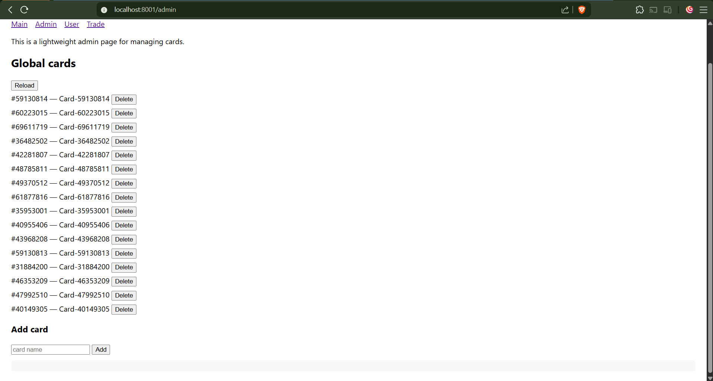
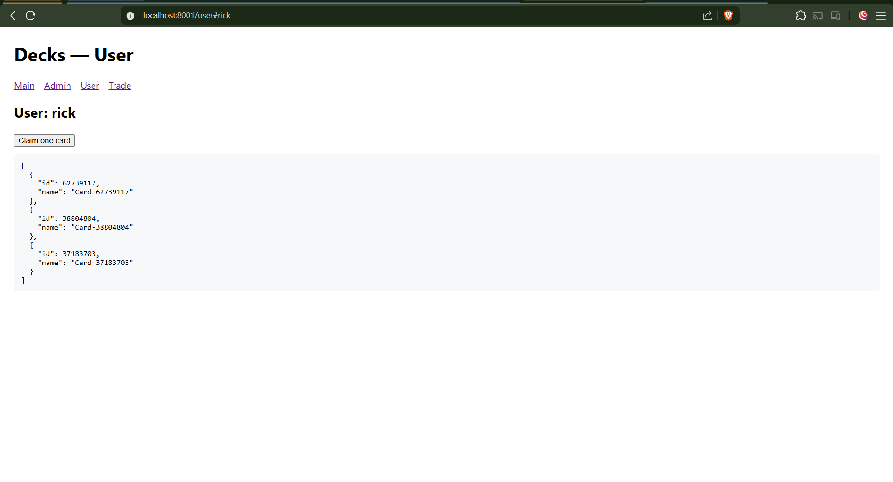
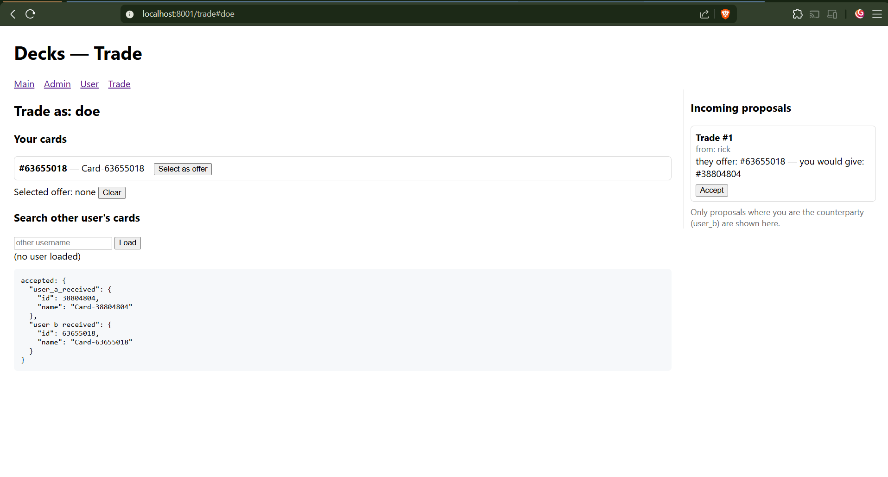

# Decks Service

This service manages the player's decks.

## Overview

- Leader election: the node with the highest numeric `-id` is the leader.
- Leader handles mutating operations and asynchronously replicates them to peers via POST /replicate.
- Followers forward mutating requests to the leader; GET requests are served locally from each node's deck store.

## Real Usage

### Starting

- **Node 1**
```sh
go run ./decks -id=1 -addr=http://localhost:8001 -peers=1=http://localhost:8001,2=http://localhost:8002,3=http://localhost:8003
```

- **Node 2**
```sh
go run ./decks -id=2 -addr=http://localhost:8002 -peers=1=http://localhost:8001,2=http://localhost:8002,3=http://localhost:8003
```

- **Node 3**
```sh
go run ./decks -id=3 -addr=http://localhost:8003 -peers=1=http://localhost:8001,2=http://localhost:8002,3=http://localhost:8003
```

### Frontend

Open the frontend at `http://localhost:8081`, `http://localhost:8082` or `http://localhost:8083` and interact with it. 

This minimal static frontend is included under `decks/frontend/` folder and is served at `/`.

There are 4 pages which you can interact: Homepage, User inventory, Administrator Dashboard and User Trading page.








## API Endpoints

There are two kinds of decks:

- Global deck: Global Storage that generates and rewards players.
- Per-user deck: User owned deck management.

Per-user API:

- **GET** `/users/:user/cards`
    - List cards for `:user`
- **POST** `/users/:user/cards`
    - Add a card for `:user` (JSON: `{"id":123,"name":"ace"}`)
- **DELETE** `/users/:user/cards/:id`
    - Remove card `:id` from `:user`'s deck

Global Deck API:

- **GET** `/cards`
    - List cards from the global deck
- **POST** `/cards`
    - Add a card to the global deck
- **DELETE** `/cards/:id`
    - Remove a card from the global deck

Node API:
- **POST** `/replicate`
    - Internal endpoint for replication (peers only)
- **GET** `/snapshot`
    - Internal endpoint for sync with leader (peer only)
- **GET** `/status`
    - Node status and current leader

Some of those endpoints just returns values and others proxies the leader node. But for the user the behavior would be the same for any node.

## API Usage

### Administrator

Per-user examples:

Add a card for user `john`:

```sh
curl -X POST http://localhost:8001/users/john/cards -H "Content-Type: application/json" -d '{"id":101,"name":"Ace"}'
```

List john's cards:

```sh
curl http://localhost:8002/users/john/cards
```

Delete a card for john:

```sh
curl -X DELETE http://localhost:8002/users/john/cards/101 -v
```

Global deck examples:

Add to global deck:

```sh
curl -X POST http://localhost:8001/cards -H "Content-Type: application/json" -d '{"id":201,"name":"King"}'
```

List global deck:

```sh
curl http://localhost:8003/cards
```

### Claiming a card

Claim a card for `john`:

```sh
curl http://localhost:8001/users/john/claim
```

```sh
curl http://localhost:8001/users/john/cards
```

As admin, you can check the before and after:

```sh
curl http://localhost:8001/cards
```

### Trading cards

```sh
curl http://localhost:8001/john/claim
curl http://localhost:8001/john/cards
curl http://localhost:8001/doe/cards
```

```sh
curl -X POST http://localhost:8001/trade -H "Content-Type: application/json" -d '{"user_a":"john","user_b":"doe","a_card_id": :card-id>,"b_card_id": <card-id>}'
```

If you try to accept with the wrong user:

```sh
curl -X POST http://localhost:8001/trade/1/accept -H "Content-Type: application/json" -d '{"user":"john"}'
# only the counterparty can accept the trade
```

So...

```sh
curl -X POST http://localhost:8001/trade/1/accept -H "Content-Type: application/json" -d '{"user":"doe"}'
```

```sh
curl http://localhost:8001/john/cards
curl http://localhost:8001/doe/cards
```

## Features

### Admins
- Manage the global deck: create, remove and list global cards.
- Inspect cluster and node state
- Responsible for operational tasks and global data

### Users
- Manage their own per-user deck: list, add and remove cards belonging to their account.
- Read global deck contents.

### System
- Leader: Takes decisions and followers replicates
- Leader election: elects the highest on-line ID leader
- If the leader fails, re-elect a new leader
- If some follower fails, this gets a snapshot from the current leader.
